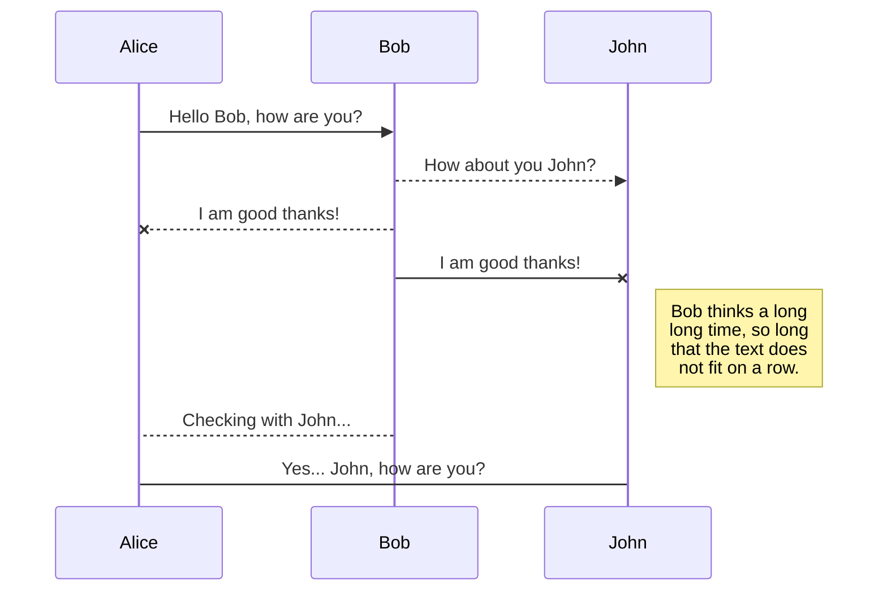
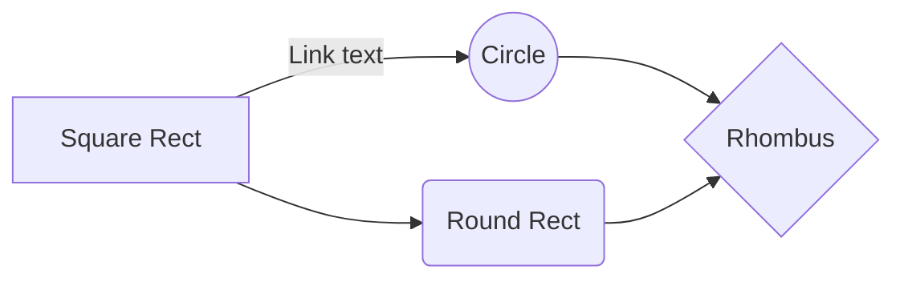

# LAB 4: Adquisición de señales sEMG con BITalino
## 1. Introducción
El presente laboratorio trabajó la adquisición y análisis de señales biomédicas como EMG utilizando el kit BITalino (r)evolution Board y el software OpenSignals (r)evolution. Estas herramientas permiten la captura y visualización de señales fisiológicas mediante electrodos conectados al músculo.

Durante la práctica, se realizó la configuración del sistema de adquisición, el cual incluye la conexión Bluetooth módulo-computadora y configuración del programa. Posteriormente, se llevó a cabo la visualización y registro de las señales obtenidas, permitiendo su análisis tanto en tiempo real como mediante procesamiento posterior en Python.

## 2. Metodología
### 2. 1. Objetivos

-   Adquirir señales biomédicas de EMG y ECG.
-   Configurar correctamente el sistema BITalino.
-   Extraer y procesar la información de las señales adquiridas mediante OpenSignals (r)evolution.

### 2.2. Materiales y equipos

#### Kit BITalino (r)evolution
Plataforma integrada para adquisición de señales fisiológicas. Incluye:
-   Placa BITalino (r)evolution
-   Electrodos:
-- Cable de 3 vías (para EMG/ECG/EEG) de 30 cm.
-- Cable de 2 vías (para EDA) de 10 cm.
-   Batería Li-Po 3.7 V, 500 mAh

#### Laptop como módulo de procesamiento de datos
Laptop con Windows 11 y el software OpenSignals (r)evolution instalado para la adquisición, visualización y almacenamiento de las señales.

### 2.3. Sujetos de estudio
Participaron voluntariamente dos estudiantes del curso _Introducción a Señales Médicas_ de la Universidad Peruana Cayetano Heredia, sin antecedentes de lesiones musculoesqueléticas en miembros superiores o inferiores.

### 2.4. Procedimiento experimental
**Colocación de electrodos**
Para cada músculo evaluado, se siguió el siguiente protocolo:
-   Se trazó una línea imaginaria sobre el eje longitudinal del músculo.
-   Se colocaron dos electrodos activos alineados con las fibras musculares, separados entre 4 y 5 cm.
-   Se ubicó un electrodo de referencia en una zona ósea cercana a la articulación humero-radio-cubital.
-   Se conectó el cable de tres derivaciones al sensor EMG y este al canal analógico A1 del BITalino.
-   Se verificó que la señal basal presentara bajo nivel de ruido (pico a pico menor a 0.05 mV).

**Músculos y ejercicios evaluados**
Para el músculo Bíceps braquial:
1.  **Ejercicio 1 – Curl de bíceps:**
-   Posición: Sentado, con el antebrazo apoyado sobre una mesa y el brazo en abducción de 90°.
-   Medición basal: 3 registros de 120 segundos cada uno, con el brazo relajado en extensión completa.
-   Ejecución: Desde la posición inicial de extensión completa del codo (0°), el sujeto realiza una flexión concéntrica hasta alcanzar 90° de flexión, sosteniendo una mancuerna de 2 kg.
-   Protocolo de repeticiones: Se realizan 5 repeticiones o más donde se realiza contracción y relajación (3 segundos cada uno). Se repite el proceso para obtener 3 mediciones del mismo ejercicio.
2.  **Ejercicio 2 – Curl martillo:**
- Posición: El sujeto se coloca en posición sentada, con el brazo extendido en posición vertical, pegado al torso, y el antebrazo en posición neutra (pulgar hacia arriba, palma orientada hacia el cuerpo).
-   Medición basal: 3 registros de 120 segundos cada uno, con el brazo relajado en extensión completa.
-   Ejecución: Utilizando la misma mancuerna, el sujeto realiza una flexión del codo desde aproximadamente 180° hasta 45°, manteniendo en todo momento el antebrazo en posición neutra.
-   Protocolo de repeticiones: Se realizan 5 repeticiones o más donde se realiza contracción y relajación (3 segundos cada uno). Se repite el proceso para obtener 3 mediciones del mismo ejercicio.

Para el caso del músculo Cuádriceps femoral (miembro inferior):
1.  **Ejercicio 1 – Sentadilla (cuádriceps):**
-   Posición: El sujeto se coloca de pie, en bipedestación, con los pies separados al ancho de los hombros.
-   Medición basal: 3 registros de 30 segundos, de pie en bipedestación estática (sin flexión de rodillas).
-   Ejecución: Desde la posición inicial con rodillas extendidas, el sujeto realiza una sentadilla controlada hasta alcanzar aproximadamente 90° de flexión de rodilla (muslos paralelos al suelo). Durante el movimiento, las rodillas se desplazan hacia adelante, sobrepasando ligeramente la línea de los pies, con el objetivo de incrementar la activación del cuádriceps.
-   Protocolo de repeticiones: Se realizan 5 repeticiones o más de sentadilla (fase excéntrica y concéntrica) de 4 segundos de duración, con descanso de 4 segundos entre cada repetición. Se repite el proceso para obtener 3 mediciones del mismo ejercicio.

**Procedimiento de adquisición**
Para cada ejercicio se siguió el protocolo basado en el manual HomeGuide #1 de PLUX:
-   Se inició la grabación en OpenSignals.
-   Se registró una línea basal de 30 segundos mínimo sin contracción muscular.
-   Se realizaron 5 ciclos consecutivos de contracción-relajación, con intensidad creciente, siendo la última contracción a máxima fuerza voluntaria (MVC).
-   Se registró otra línea basal de 30 segundos.
-   Se guardó el archivo en formato .txt para su posterior procesamiento.
-   Todas las mediciones se realizaron en un ambiente con temperatura controlada (20–22 °C) y sin fuentes de interferencia electromagnética evidentes (celulares apagados, laptops alejadas del cable de alimentación).

**Visualización de señales**
Las señales almacenadas se procesaron con un script en Google Colab y python utilizando las siguientes etapas para visualizar su comportamiento durante la construcción muscular:
-   **Filtrado:** filtro Butterworth pasa banda de 4° orden entre 20 y 500 Hz, seguido de un filtro notch de 2° orden a 60 Hz.
-   **Rectificación:** completa (valor absoluto).
-    **Cálculo del RMS:** ventana deslizante de 250 ms con solapamiento de 125 ms.
-   **Normalización:** cada valor RMS se expresó como porcentaje de la contracción voluntaria máxima (%CVM) obtenida en el ciclo más intenso.
## Rename a file

You can rename the current file by clicking the file name in the navigation bar or by clicking the **Rename** button in the file explorer.

## Delete a file

You can delete the current file by clicking the **Remove** button in the file explorer. The file will be moved into the **Trash** folder and automatically deleted after 7 days of inactivity.

## Export a file

You can export the current file by clicking **Export to disk** in the menu. You can choose to export the file as plain Markdown, as HTML using a Handlebars template or as a PDF.

# Synchronization

Synchronization is one of the biggest features of StackEdit. It enables you to synchronize any file in your workspace with other files stored in your **Google Drive**, your **Dropbox** and your **GitHub** accounts. This allows you to keep writing on other devices, collaborate with people you share the file with, integrate easily into your workflow... The synchronization mechanism takes place every minute in the background, downloading, merging, and uploading file modifications.

There are two types of synchronization and they can complement each other:

- The workspace synchronization will sync all your files, folders and settings automatically. This will allow you to fetch your workspace on any other device.
	> To start syncing your workspace, just sign in with Google in the menu.

- The file synchronization will keep one file of the workspace synced with one or multiple files in **Google Drive**, **Dropbox** or **GitHub**.
	> Before starting to sync files, you must link an account in the **Synchronize** sub-menu.

## Open a file

You can open a file from **Google Drive**, **Dropbox** or **GitHub** by opening the **Synchronize** sub-menu and clicking **Open from**. Once opened in the workspace, any modification in the file will be automatically synced.

## Save a file

You can save any file of the workspace to **Google Drive**, **Dropbox** or **GitHub** by opening the **Synchronize** sub-menu and clicking **Save on**. Even if a file in the workspace is already synced, you can save it to another location. StackEdit can sync one file with multiple locations and accounts.

## Synchronize a file

Once your file is linked to a synchronized location, StackEdit will periodically synchronize it by downloading/uploading any modification. A merge will be performed if necessary and conflicts will be resolved.

If you just have modified your file and you want to force syncing, click the **Synchronize now** button in the navigation bar.

> **Note:** The **Synchronize now** button is disabled if you have no file to synchronize.

## Manage file synchronization

Since one file can be synced with multiple locations, you can list and manage synchronized locations by clicking **File synchronization** in the **Synchronize** sub-menu. This allows you to list and remove synchronized locations that are linked to your file.

# Publication

Publishing in StackEdit makes it simple for you to publish online your files. Once you're happy with a file, you can publish it to different hosting platforms like **Blogger**, **Dropbox**, **Gist**, **GitHub**, **Google Drive**, **WordPress** and **Zendesk**. With [Handlebars templates](http://handlebarsjs.com/), you have full control over what you export.

> Before starting to publish, you must link an account in the **Publish** sub-menu.

## Publish a File

You can publish your file by opening the **Publish** sub-menu and by clicking **Publish to**. For some locations, you can choose between the following formats:

- Markdown: publish the Markdown text on a website that can interpret it (**GitHub** for instance),
- HTML: publish the file converted to HTML via a Handlebars template (on a blog for example).

## Update a publication

After publishing, StackEdit keeps your file linked to that publication which makes it easy for you to re-publish it. Once you have modified your file and you want to update your publication, click on the **Publish now** button in the navigation bar.

> **Note:** The **Publish now** button is disabled if your file has not been published yet.

## Manage file publication

Since one file can be published to multiple locations, you can list and manage publish locations by clicking **File publication** in the **Publish** sub-menu. This allows you to list and remove publication locations that are linked to your file.

# Markdown extensions

StackEdit extends the standard Markdown syntax by adding extra **Markdown extensions**, providing you with some nice features.

> **ProTip:** You can disable any **Markdown extension** in the **File properties** dialog.

## SmartyPants

SmartyPants converts ASCII punctuation characters into "smart" typographic punctuation HTML entities. For example:

|                |ASCII                          |HTML                         |
|----------------|-------------------------------|-----------------------------|
|Single backticks|`'Isn't this fun?'`            |'Isn't this fun?'            |
|Quotes          |`"Isn't this fun?"`            |"Isn't this fun?"            |
|Dashes          |`-- is en-dash, --- is em-dash`|-- is en-dash, --- is em-dash|

## KaTeX

You can render LaTeX mathematical expressions using [KaTeX](https://khan.github.io/KaTeX/):

The *Gamma function* satisfying $\Gamma(n) = (n-1)!\quad\forall n\in\mathbb N$ is via the Euler integral

$$
\Gamma(z) = \int_0^\infty t^{z-1}e^{-t}dt\,.
$$

> You can find more information about **LaTeX** mathematical expressions [here](http://meta.math.stackexchange.com/questions/5020/mathjax-basic-tutorial-and-quick-reference).

## UML diagrams

You can render UML diagrams using [Mermaid](https://mermaidjs.github.io/). For example, this will produce a sequence diagram:

And this will produce a flow chart:

